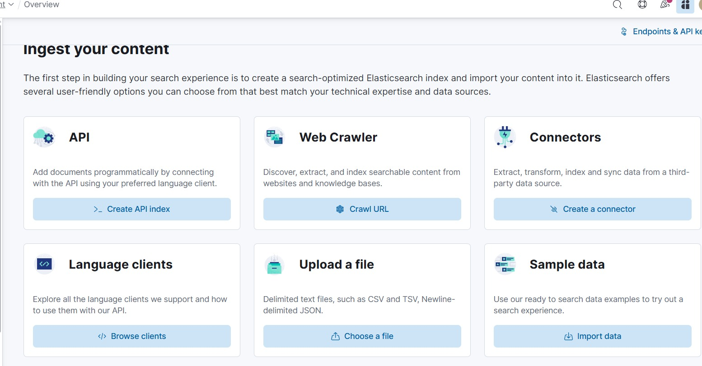
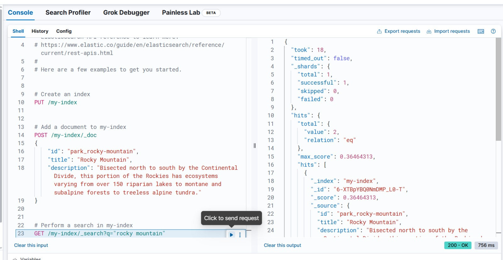
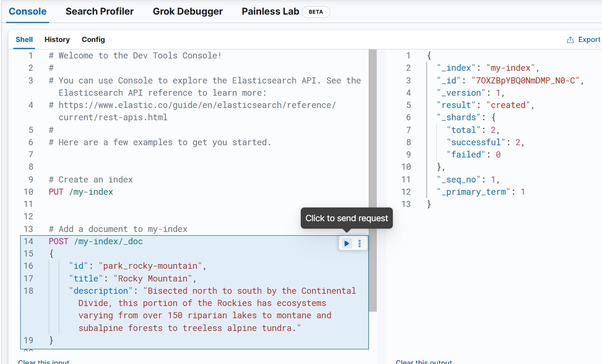

# AI-powered-search-and-indexing
## Interface used
I used ElasticSearch for this test:

## Exemple used

## Conclusions
This type of tool was, to me, similar to plataforms like postman.
So its really likely to study more about HTTP Methods and using json for queries.